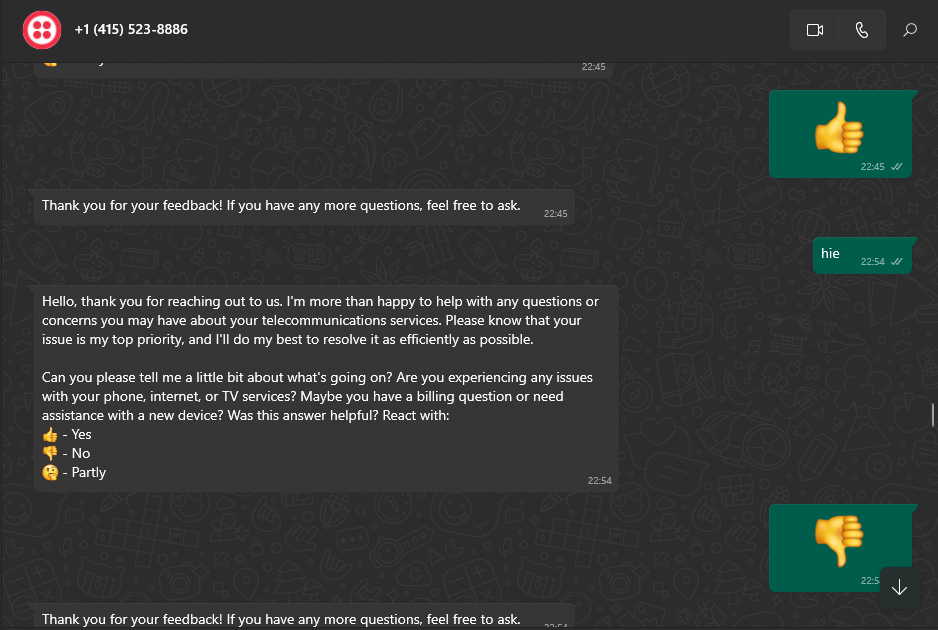

# Customer Support    Ai  System 

## 1. Project Overview
The Econet RAG (Retrieval-Augmented Generation) system is designed to enhance customer support for Econet, a leading telecommunications service provider, and its related services, including EcoSure (funeral insurance) and EcoCash (mobile banking). Each of these services has its own website, and the system integrates FAQ data from these websites to provide accurate and real-time support for customer inquiries. The RAG architecture was chosen due to its ability to combine information retrieval from FAQs with a powerful generative language model, enabling the system to handle both straightforward and complex questions. The goal is to improve customer satisfaction by providing relevant and contextual answers  to solve the challenges that they meet while using Econet Services.

## 2. Data Sources
Data is scraped from three primary sources: 

- [Econet](https://www.econet.co.zw/)
- [Ecocash](https://www.ecocash.co.zw/)
- [Ecosure](https://www.ecosure.com/)

Scraping is performed using a Python-based web scraper, which extracts FAQ sections from these websites. The extracted data is cleaned and pre-processed, removing HTML tags and irrelevant content.

After cleaning, the FAQ data is embedded using **sentence transformers**, which convert the text into dense vectors representing semantic meaning. These vectors are then stored in **Elasticsearch**, a powerful vector database that supports fast and efficient retrieval based on semantic similarity.

## 3. Technology Stack

1. **Terraform**

    Used to provision the AWS infrastructure. This includes creating and managing resources like EC2 instances

     - **AWS EC2**
     
         The application is deployed on an EC2 instance with *16 GB RAM and 70 GB SSD* for handling the backend operations and hosting the RAG model.

   -  **S3 Bucket**

         Stores the AWS Terraform state files.

    - **DynamoDB**
     Used to lock the Terraform state, ensuring safe and reliable infrastructure changes.

2. **Elasticsearch**

    Utilized for storing and retrieving indexed FAQ data, with support for hybrid search (both keyword and vector-based similarity search).

3. **Large Language Models (LLMs)**

   - **LLaMA 70B**
   
     The primary model for generating responses based on FAQ data and user queries.

   - **Mistral, Gemma**
   
     Additional LLMs considered or tested for various use cases in the response generation process.

4. **PostgreSQL**

     Serves as the relational database for storing user conversations, feedback, and interaction data. It is used for analytics and improving the system's responses.

5. **Grafana**

    Provides a monitoring dashboard to track key metrics such as token usage, response times, and inference costs, offering real-time insights into system performance.

6. **Prometheus**

    Complements Grafana by collecting and aggregating system metrics, which are visualized in Grafana.

7. **Docker**

    The application is containerized using Docker to ensure portability and consistency across different environments.

8. **Twilio API**

     Allows users to interact with the system via WhatsApp, sending queries and receiving responses seamlessly.

9. **Apache Airflow**

     Manages and orchestrates the scraping tasks and pipeline workflows for retrieving FAQ data from Econet, EcoSure, and EcoCash websites.

    
    
    
    S

  

11. **FastAPI**

     The backend API is built using FastAPI, which handles user queries and integrates with Twilio to communicate via WhatsApp.

## 3. How It Works
The RAG system follows a pipeline designed for scalability and efficiency

**Data Ingestion**

- The ingestion process is orchestrated using **Apache Airflow**, which handles the scheduling and monitoring of data scraping tasks across the different websites.

**Data Embedding**
- Once the FAQ data is scraped, it is passed through a sentence embedding model (using sentence transformers). This converts the textual data into vector representations.

**Storage in Elasticsearch**
- The embedded vectors are stored in **Elasticsearch**, where they can be queried using similarity-based searches. This vector store allows for efficient and accurate retrieval of relevant information.

**Hybrid Search Mechanism**
- When a user query is received, a hybrid search is performed. It involves both traditional keyword-based retrieval and vector similarity search. This ensures that both exact matches and semantically similar answers are considered.

## 4. RAG Flow Evaluation

The workflow of the RAG system starts with a user question:
- The user’s question is embedded into a vector.
- A search is conducted in the Elasticsearch vector store to retrieve the top 5 similar FAQ vectors.
- These top 5 results are used as context for the generative language model to create a response.

Several language models were tested, including GPT-3, Mistrael, and LLaMA models. The **LLaMA 70B model** was selected for its accuracy and efficiency. It was deployed using **QROQ Cloud** leveraging **LPU (Large-Scale Processing Unit) technology**, which provided superior inference speed and performance in generating responses.

## 5. Retrieval Evaluation
To ensure high-quality answers, the system incorporates multiple layers of evaluation:

**Relevance Assessment**

 Each retrieved FAQ response is ranked based on relevance. This is done using cosine similarity between the query vector and FAQ vectors.

 

**Second-Layer LLM Judgement**

A secondary **LLM (Language Learning Model)** is used as a "judge" to evaluate the relevance and accuracy of the generated responses, in this case i used LLaMA 70B model. The results are assessed for their coherence and appropriateness to the user query.

**Feedback Incorporation**

 Users can provide feedback on the relevance of answers. Feedback (positive or negative) is stored in a PostgreSQL database and is used to adjust the model’s future responses and improve retrieval accuracy.

  

## 6. Monitoring

The system uses **Prometheus** ,**Postgres** and **Grafana** for monitoring purposes:

**Performance Metrics**

 Key performance indicators (KPIs) such as response time, query throughput, and Elasticsearch latency are tracked.

**Inference Costs** Monitoring of inference costs helps optimize resource usage, especially for the large LLMs.

  

**User Interactions** 

Metrics such as user satisfaction (based on feedback scores) and number of interactions per day are recorded and analyzed.

## 7. Project Deployment

The RAG system is deployed on **AWS EC2** instances for scalable cloud-based processing:

- **Provisioning**

    EC2 instances are configured 

    

**Containerization**

 The application is containerized using **Docker** to ensure consistency and ease of deployment across environments.

**Resource Management** 

Resources such as CPU, memory, and disk are monitored to ensure smooth operation and prevent bottlenecks.

  

   

## 8. Project Interface

User interaction with the system is facilitated through **WhatsApp**, integrated using the **Twilio API**

**WhatsApp Interface**

 Users send queries via WhatsApp, which are processed by the backend system.

   

**Feedback Mechanism**
After receiving a response, users can rate the relevance of the answers (e.g., thumbs up or down), which is stored in a **PostgreSQL** database. This feedback is vital for continuous improvement of the system.

## 9. Model Monitoring Interface
To ensure the long-term performance of the LLM and other models, the following are tracked

**Model Accuracy**

 Regular evaluation of the model’s performance in terms of query understanding and response generation.

**Performance Over Time**

Continuous tracking of key metrics such as response quality, user feedback, and system latency using the **Prometheus-Grafana** stack.

## 10 .How to reproduce the project

  Create an s3 

## 11. Areas of Improvement

Several areas for potential optimization have been identified:
- Add a CI/CD pipeline

- Add load balancers and Autoscaling groups on Aws

-Add Data Quality Test for the Scraped data 

- Further optimizing inference costs by exploring model pruning techniques, quantization, or switching to lighter models for specific types of queries.

- Enhancing the user interface on WhatsApp by adding multi-turn conversations and improved contextual understanding to handle follow-up questions more effectively.

